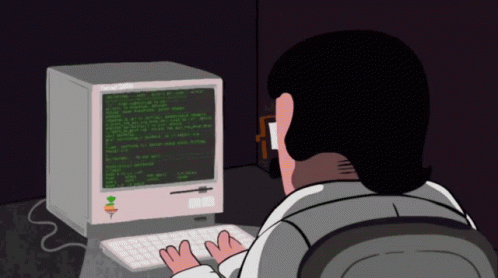

  

# Hello, I'm Osama!

Welcome to my GitHub profile! I'm passionate about computers. Here, you'll find a collection of my projects and contributions to Digital Design, AI, Robotics and Computer Vision. Feel free to explore and get inspired!
## About Me

- 🌍 **Location**: Jeddah, Saudi Arabia
- 💼 **Profession**: Electrical & Computer Engineering
- 🎓 **Education**: King Abdulaziz University
- 💡 **Interests**: Digital Design, AI, Robotics(ROS) and Computer Vision

## Projects

Here are a few highlighted projects I've worked on:

[**SDP**](https://github.com/witcherxz/SDP): Indoor localization and navigation system for autonomous robots.

[**SqueezNet**](https://github.com/osamaalsahafi/Appling-transfer-learning-to-SqueezeNet-on-COVID-10-chest-XRAY-dataset): Appling-transfer-learning.

For a complete list of my projects, please visit [my portfolio website](https://github.com/osamaalsahafi?tab=repositories).

## Connect with Me

I'm always interested in connecting with fellow developers and professionals. Feel free to reach out to me through the following channels:

- **Linkedin**: [osama-alsahafi](https://www.linkedin.com/in/osama-alsahafi/)
- **Twitter**: [@iios_x](https://twitter.com/iios_x)
- **Email**: [alsahafiosama23@gmail.com](alsahafiosama23@gmail.com)

## Skills

- **Programming languages**: [Assembly, RISC-V, C/C++, Java, Matlab, Julia, Python]
- **Technologies**: [Jetson nano, ESP32, PIC18 Family, Arduino, Raspberry PI]
- **Frameworks/Libraries**: [Robot Operating System, Opencv, TensorFlow, Pytorch, Myhdl, Ultralytics]
- **Tools**: [Visual Studio Code, Cmake, Putty & WinSCP, Cisco Packet Tracer]

Thank you for visiting my profile. If you have any questions or would like to collaborate, feel free to reach out. Happy coding!
